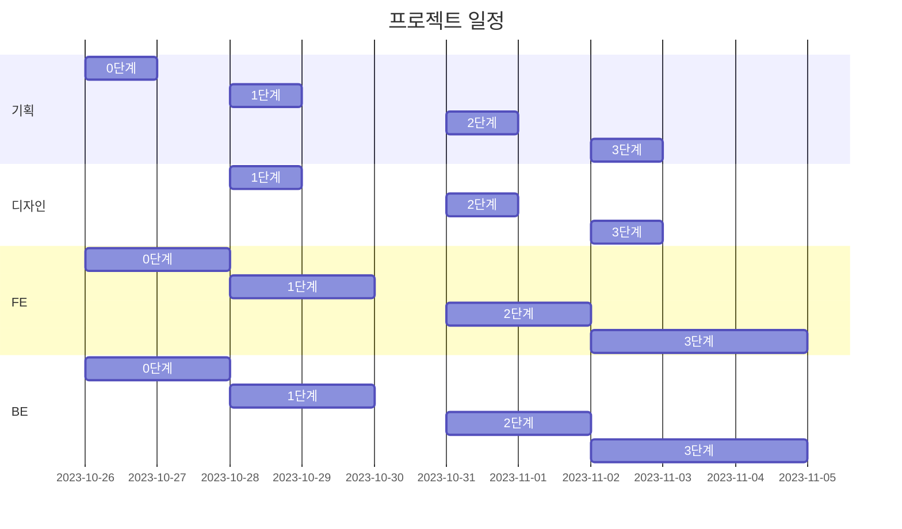

일정 계획
-----------


DB 모델
-----------


URL 구조
-----------
```
1.1 ''                                 : 메인
1.2 'about/'                           : 사이트 소개
-----------------------------------------------------
2.1 'restaurants/'                     : 추천식당 목록
2.2 'restaurants/<int:pk>/'            : 추천식당 읽기
2.3 'restaurants/recommend/'           : 추천식당 작성
2.4 'restaurants/<int:pk>/edit/'       : 추천식당 업데이트
2.5 'restaurants/<int:pk>/delete/'     : 추천식당 삭제
-----------------------------------------------------
3.1 'accounts/login'                   : 로그인
3.2 'accounts/logout'                  : 로그아웃
3.3 'accounts/signup'                  : 회원가입
3.4 'accounts/profile'                 : 프로필
```

| 앱이름: `main` | views 함수이름 | html 파일이름 | 비고    |
|:--------------|:---------------|:-------------|:--------|
|`''`           |index           |`index.html`  |         |
|`'about/'`     |about           |`about.html`  |         |

| 앱이름: `restaurants`           | views 함수이름    | html 파일이름                    |  비고                         |
|:--------------------------------|:-----------------|:--------------------------------|:-----------------------------|
|`'restaurants/'`                 |RestaurantList    |`restaurant_list.html`           |                              |
|`'restaurants/<int:pk>/'`        |RestaurantDetail  |`restaurant_detail.html`         |게시물이 없을 경우에는 404로 연결|
|`'restaurants/recommend/'`       |RestaurantCreate  |`restaurant_form.html`           |                              |
|`'restaurants/<int:pk>/edit/'`   |RestaurantUpdate  |`restaurant_form.html`           |                              |
|`'restaurants/<int:pk>/delete/'` |RestaurantDelete  |`restaurant_confirm_delete.html` |                              |

| 앱이름: `accounts`  | views 함수이름 | html 파일이름 | 비고    |
|:--------------------|:---------------|:-------------|:--------|
|`'accounts/login/'`  |login           |`login.html`  |         |
|`'accounts/logout/'` |logout          |`logout.html` |         |
|`'accounts/signup/'` |signup          |`signup.html` |         |
|`'accounts/profile/'`|profile         |`profile.html`|         |