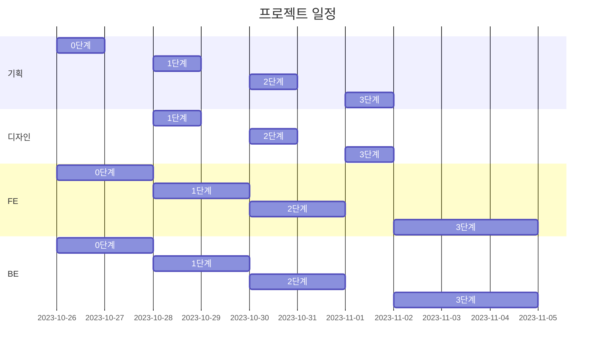

일정 계획
-----------


DB 모델
-----------


URL 구조
-----------
```
1.1 ''                                 : 메인
1.2 'about/'                           : 사이트 소개
2.1 'restaurants/'                     : 추천식당 목록
2.2 'restaurants/<int:pk>/'            : 추천식당 읽기
```

| 앱이름: `main` | views 함수이름 | html 파일이름 | 비고    |
|:--------------|:---------------|:-------------|:--------|
|`''`           |index           |`index.html`  |         |
|`'about/'`     |about           |`about.html`  |         |

| 앱이름: `restaurants`            | views 함수이름    | html 파일이름           |  비고                         |
|:--------------------------------|:-----------------|:------------------------|:------------------------------|
|`'restaurants/'`                 |RestaurantsList   |`restaurants.html`       |                               |
|`'restaurants/<int:pk>'`         |RestaurantsDetail |`restaurants-detail.html`|게시물이 없을 경우에는 404로 연결|