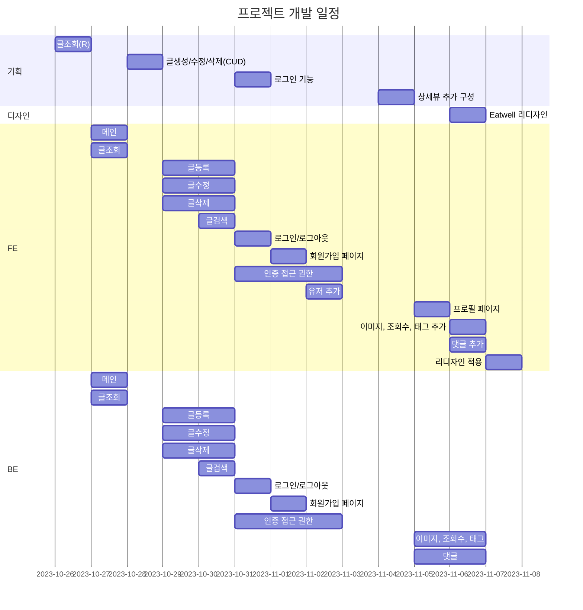
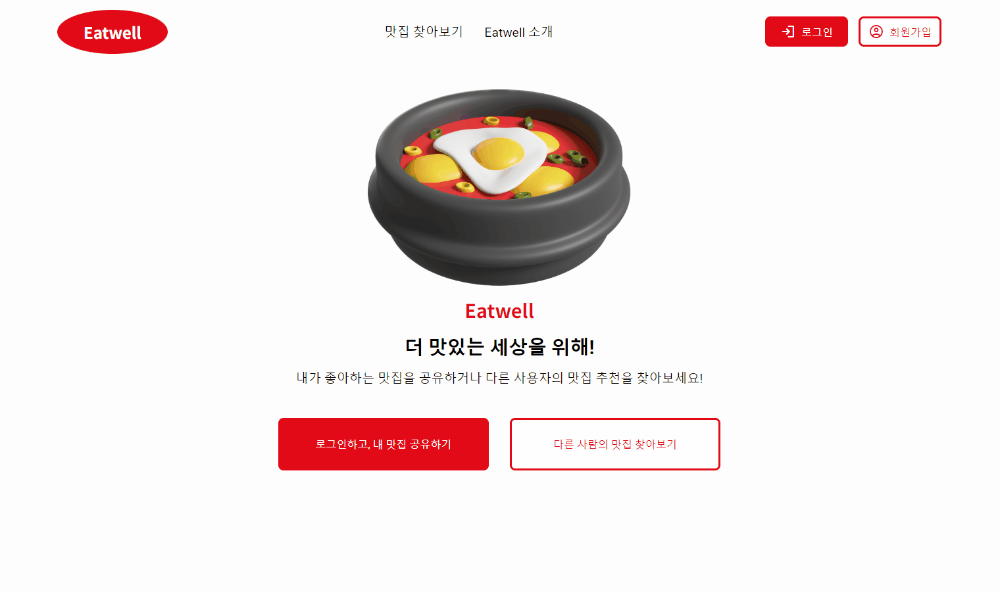
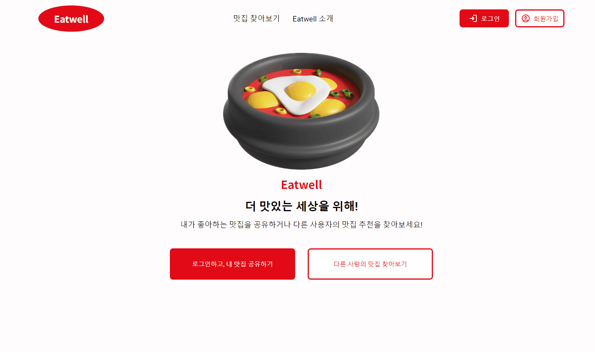
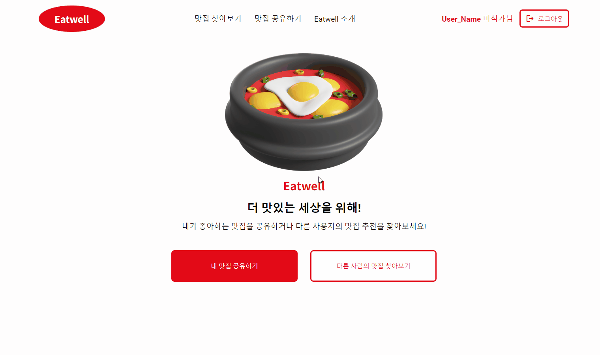
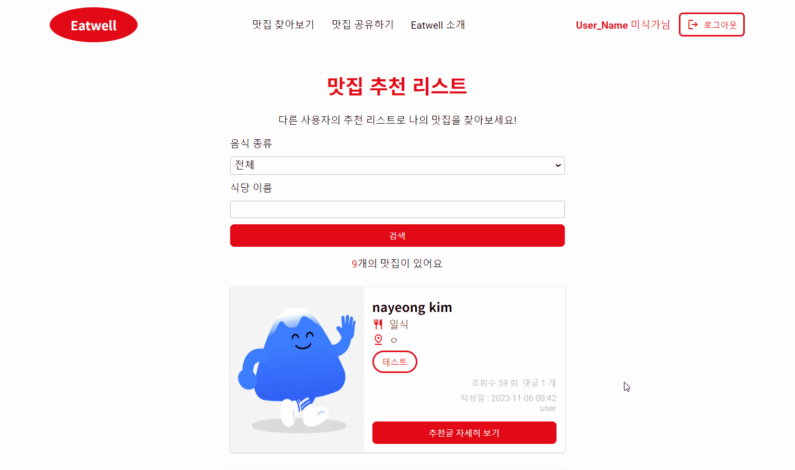
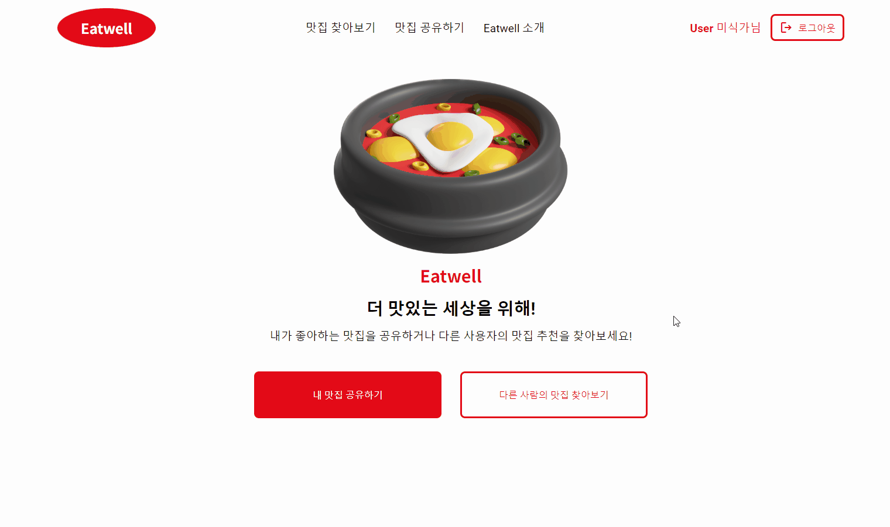
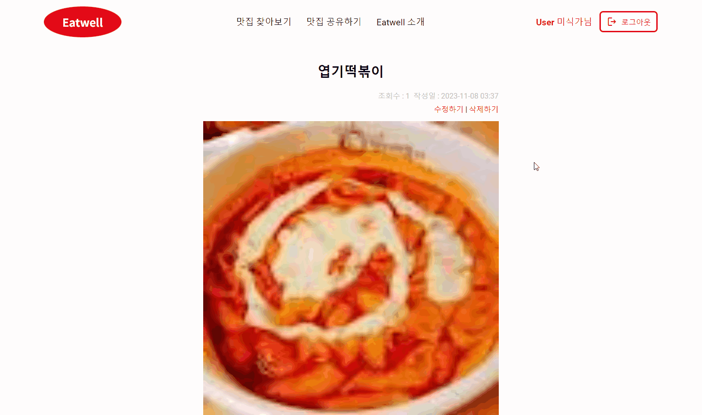
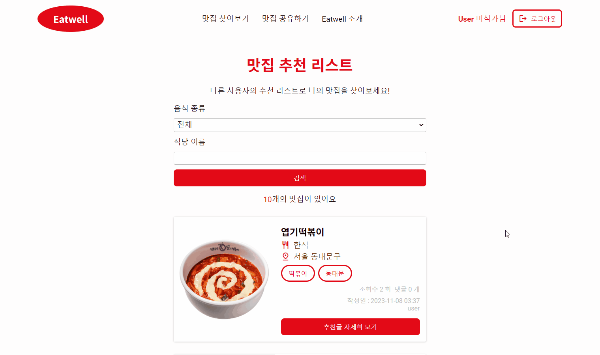

# Eatwell

음식을 좋아하는 사람들을 위한 맛집 공유 플랫폼


목차
---

* [1. 목표와 기능](#1-목표와-기능)
    + [1-1. 목표](#1-1-목표)
    + [1-2. 기능](#1-2-기능)
* [2. 개발 환경](#2-개발-환경)
* [3. 프로젝트 구조와 개발 일정](#3-프로젝트-구조와-개발-일정)
    + [3-1. 프로젝트 구조](#3-1-프로젝트-구조)
    + [3-2. 개발 일정](#3-2-개발-일정)
* [4. URL 구조](#4-url-구조)
    + [4-1. 메인](#4-1-메인)
    + [4-2. 커뮤니티](#4-2-커뮤니티)
    + [4-3. 계정](#4-3-계정)
* [5. ERD](#5-erd)
* [6. IA](#6-ia)
* [7. UI 및 기능](#7-ui-및-기능)
* [8. django 웹사이트 실행방법 (window)](#8-django-웹사이트-실행방법-window)

## 1. 목표와 기능

### 1-1. 목표

1. 장고를 사용해서 동적인 웹사이트 만들기
2. 음식을 좋아하는 사람들을 위한 플랫폼
3. 새로운 맛집을 발견하고 자신의 음식 취향을 공유할 수 있는 커뮤니티

### 1-2. 기능

#### [우리가 좋아하는 맛집을 공유하기]

- 커뮤니티 유저는 방문한 맛집이나 좋아하는 맛집을 다른 사용자와 공유할 수 있습니다.
- 맛집의 이름, 위치, 사진 등을 포함한 리뷰를 작성하고 업로드할 수 있습니다.

#### [웹사이트에 방문한 다른 사용자가 공유한 맛집 검색하기]

- 커뮤니티 유저가 원하는 맛집을 찾을 수 있도록 도와줍니다.
- 다른 사용자들이 공유한 맛집의 리뷰를 검색하고 볼 수 있습니다.
- 음식 종류, 맛집 이름 기준으로 검색할 수 있습니다.
- 또한, 커뮤니티 유저가 관심있는 리뷰에 댓글을 달 수 있습니다.

<div style="display: flex;">


</div>

## 2. 개발 환경

<div>
  [BE]
  
  
</div>
<div>
  [FE]
  
  
  
</div> 

## 3. 프로젝트 구조와 개발 일정

### 3-1. 프로젝트 구조

```
📦EatWell
 ┣ 📂accounts (app)
 ┣ 📂config (startproject)
 ┣ 📂main (app)
 ┣ 📂restaurants (app)
 ┣ 📂static
 ┃ ┣ 📂images
 ┃ ┣ 📂scripts
 ┃ ┗ 📂styles
 ┣ 📂templates
 ┃ ┣ 📂accounts
 ┃ ┣ 📂main
 ┃ ┣ 📂restaurants
 ┃ ┣ 📜404.html
 ┃ ┣ 📜500.html
 ┃ ┗ 📜base_generic.html
 ┣ 📜.gitignore
 ┣ 📜manage.py
 ┣ 📜README.md
 ┗ 📜requirements.txt
```

### 3-2. 개발 일정



## 4. URL 구조

```
1. 메인
1.1 ''                                 : 메인
1.2 'about/'                           : 사이트 소개
-----------------------------------------------------
2. 커뮤니티
2.1 'restaurants/'                     : 추천맛집 목록
2.2 'restaurants/<int:pk>/'            : 추천맛집 읽기
2.3 'restaurants/recommend/'           : 추천맛집 작성
2.4 'restaurants/<int:pk>/edit/'       : 추천맛집 업데이트
2.5 'restaurants/<int:pk>/delete/'     : 추천맛집 삭제
-----------------------------------------------------
3. 계정
3.1 'accounts/login'                   : 로그인
3.2 'accounts/logout'                  : 로그아웃
3.3 'accounts/signup'                  : 회원가입
3.4 'accounts/profile'                 : 프로필
```

### 4-1. 메인

| 앱이름: `main` | views 함수이름 | html 파일이름 | 비고 |
|:------------|:-----------|:-------------|:---|
| `''`        | index      | `index.html` |    |
| `'about/'`  | about      | `about.html` |    |

### 4-2. 커뮤니티

| 앱이름: `restaurants`            | views 함수이름    | html 파일이름                     | 비고                    |
|:---------------------------------|:-----------------|:---------------------------------|:----------------------|
| `'restaurants/'`                 | RestaurantList   | `restaurant_list.html`           | 검색기능 추가               |
| `'restaurants/<int:pk>/'`        | RestaurantDetail | `restaurant_detail.html`         | 게시물이 없을 경우, 404로 연결   |
| `'restaurants/recommend/'`       | RestaurantCreate | `restaurant_form.html`           | 작성 완료 후, 게시글 목록 화면 연결 |
| `'restaurants/<int:pk>/edit/'`   | RestaurantUpdate | `restaurant_form.html`           | 수정 완료 후, 게시글 상세 화면 연결 |
| `'restaurants/<int:pk>/delete/'` | RestaurantDelete | `restaurant_confirm_delete.html` | 삭제 완료 후, 게시글 목록 화면 연결 |

### 4-3. 계정

| 앱이름: `accounts`    | views 함수이름 | html 파일이름 | 비고              |
|:----------------------|:-----------|:---------------|:----------------|
| `'accounts/login/'`   | login      | `login.html`   | 로그인한 사용자는 접근 제한 |
| `'accounts/logout/'`  | logout     | `logout.html`  |                 |
| `'accounts/signup/'`  | signup     | `signup.html`  | 로그인한 사용자는 접근 제한 |
| `'accounts/profile/'` | profile    | `profile.html` |                 |

## 5. ERD


## 6. IA


<p></p>

## 7. UI 및 기능

| UI                                                        | 기능                                                                                                                                      |
|-----------------------------------------------------------|-----------------------------------------------------------------------------------------------------------------------------------------|
|                  | <strong>메인페이지</strong><li>맛집검색하기와 맛집공유하기 버튼</li><li>상단의 회원가입/로그인 버튼</li>                                                                |
|  | <strong>회원가입/로그인</strong><li>회원가입에서 username, password, email 입력</li><li>로그인에서 username, password 입력</li>                               |
|                  | <strong>추천 맛집 글 목록</strong><li>모든 사용자들이 보기 가능</li><li>음식종류와 맛집이름에 따라 검색이 가능</li>                                                        |
|                | <strong>추천 맛집 글 상세</strong><li>추천 맛집 글을 자세히 볼 수 있는 기능</li><li>상세 글에 들어갈때마다 조회수 카운트</li><li>댓글 보기는 누구나 가능, 댓글 달기는 로그인한 유저만</li>          |
|                | <strong>추천 맛집 글 작성</strong><li>로그인 한 유저만 사용 가능</li><li>생성 후, 글 목록 화면으로 리다이렉트</li><li>사진 업로드 가능</li>                                     |
|                | <strong>추천 맛집 글 수정</strong><li>로그인한 본인의 게시글만 수정 가능</li><li>수정 후, 글 상세 화면으로 리다이렉트</li>                                                   |
|                | <strong>추천 맛집 글 삭제</strong><li>로그인한 본인의 게시글만 삭제 가능</li><li>삭제 후, 글 목록 화면으로 리다이렉트</li><li>삭제된 게시물에 접근 시도 시, <페이지를 찾을 수 없습니다> 페이지 노출</li> |

## 8. django 웹사이트 실행방법 (window)

1. [django 웹사이트] 폴더에 venv라는 가상환경을 `python -m venv venv`라는 명령어를 통해 구축
2. `venv/Scripts/activate.bat`으로 가상환경 실행(계속 실행하고 있어야 함)
3. `pip install -r requirements.txt` 명령어를 입력해 필요한 모듈 설치
4. 아래 명령어를 순서대로 입력
    - `python manage.py makemigrations restaurants`
    - `python manage.py migrate restaurants`
    - `python manage.py migrate`
5. `python manage.py runserver` 명령어로 서버 구동시킨 후 "`127.0.0.1:8000`"으로 접속
6. 게시물을 작성해보기 위해서는 서버를 잠시 멈추고 `python manage.py createsuperuser`를 통해 관리자 계정을 만들어서 로그인하면 게시물을 작성할 수 있다.